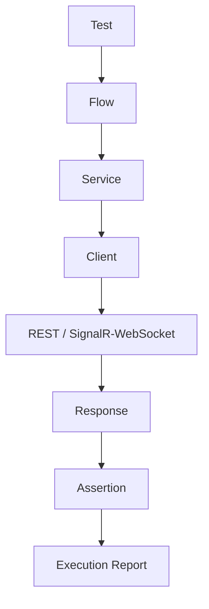

# Integration Automation Portfolio


A sanitized QA/SDET portfolio project that demonstrates layered integration
testing for device-oriented services. The implementation includes REST and
SignalR/WebSocket clients, reusable service wrappers, positive and negative
flows, response-contract assertions, stress scenarios, and structured reports.

This repository is a portfolio representation. It is not connected to a
production system. End-to-end tests require a compatible local mock or demo
service and are skipped unless explicitly enabled.

## What this project demonstrates

- Python test automation with Pytest
- REST API request and response validation
- SignalR/WebSocket connection, handshake, and message testing
- Layered Test → Flow → Service → Client architecture
- Positive, negative, contract, retry, timeout, and race-condition scenarios
- Environment-driven configuration with safe example values
- Step-level execution reporting and response redaction
- Scenario coverage metadata and a repeatable execution matrix

## Architecture



- **Test** selects a scenario and controls its environment.
- **Flow** orchestrates a reusable, business-neutral sequence.
- **Service** exposes operations without leaking transport details.
- **Client** owns REST or SignalR/WebSocket communication.
- **Response** captures status, payload, and protocol results.
- **Assertion** validates response contracts and expected outcomes.
- **Execution Report** records steps, payloads, responses, expectations, and
  errors with sensitive values redacted by default.

## Project layout

```text
config/       environment settings and mock-service examples
clients/      REST and SignalR/WebSocket transport clients
services/     reusable service wrappers
flows/        lifecycle, synchronization, routing, upload, and container flows
assertions/   response-contract assertions
tests/unit/   isolated unit tests
tests/success/positive integration flows
tests/negative/negative scenario flows
tests/stress/ volume, concurrency, and race scenarios
scripts/      local scenario-matrix runner
docs/         architecture, coverage, configuration, and scenario notes
postman/      generic Postman examples
utils/        logging, test data, stress helpers, and reporting
```

The generic coverage catalog is available in
[`config/scenario_catalog.py`](config/scenario_catalog.py), with the human
readable matrix in [`docs/SCENARIO_COVERAGE_MATRIX.md`](docs/SCENARIO_COVERAGE_MATRIX.md).

## Test categories

| Category | Purpose | Default behavior |
|---|---|---|
| Unit | Client, service, assertion, settings, and utility checks | Runs locally |
| Positive | Healthy integration and success contracts | Requires `RUN_E2E=1` |
| Negative | Invalid input and expected rejection behavior | Requires `RUN_E2E=1` |
| Contract | Shared response shape, counters, errors, and identity rules | Depends on suite |
| Stress | Volume, retry, concurrency, and race behavior | Excluded by default |

## Configuration

```powershell
.venv\Scripts\python.exe -m pip install -r requirements.txt
Copy-Item config/test.env.example config/test.env
```

Set `BASE_URL` and `WS_URL` in the ignored `config/test.env` to a local mock or
demo service. The checked-in examples use reserved placeholder values such as
`api.example.invalid`, `demo-device`, and `demo-token`. Never commit real
credentials, tokens, internal URLs, or environment-specific files.

## Test execution

Unit tests:

```powershell
.venv\Scripts\python.exe -m pytest tests/unit -q
```

Default safe suite:

```powershell
.venv\Scripts\python.exe -m pytest -q
```

Positive/integration scenarios:

```powershell
$env:RUN_E2E="1"
.venv\Scripts\python.exe -m pytest tests/success -q -s
```

Negative scenarios:

```powershell
$env:RUN_E2E="1"
.venv\Scripts\python.exe -m pytest tests/negative -q -s
```

Stress scenarios are intentionally excluded from the default run. If a local
fixture is ready, collect or run them explicitly:

```powershell
$env:RUN_E2E="1"
.venv\Scripts\python.exe -m pytest tests/stress -q -s -o addopts=""
```

The local scenario matrix runner can list its planned entries without making
network calls:

```powershell
.venv\Scripts\python.exe -m scripts.run_scenarios --list
```

Running the matrix without `--list` requires the configured local mock/demo
service and the relevant fixtures.

## Reporting

Execution helpers capture step status, request payload, response, expected
result, errors, and execution state after a prerequisite fails. Generated
logs, reports, coverage files, and Allure output are ignored by Git. A
representative report format is shown in
[`docs/sample-test-report.md`](docs/sample-test-report.md).

## CI/CD

GitHub Actions runs the unit suite, the default safe Pytest suite, and a
repository-level secret-pattern check. End-to-end and stress scenarios are not
run in CI because this public repository does not provide a production or
shared test environment.

## Public sanitization

This repository intentionally preserves the shape of an organized automation
codebase while removing identifying implementation details:

- Company names, internal ticket identifiers, service names, and document
  references were replaced with neutral terminology.
- Real hosts, URLs, IP addresses, credentials, tokens, and device identifiers
  were replaced with safe placeholders.
- Existing flow and test structure was preserved so the engineering approach
  remains visible without exposing private systems.

See [`SECURITY.md`](SECURITY.md) for the public-repository security boundary.

## Limitations

- End-to-end tests require a compatible local mock or demo service.
- Some scenarios require externally prepared fixtures or log/database evidence.
- Stress tests are policy-disabled by default until their fixtures are ready.
- This repository does not claim access to, or validation against, any real
  production endpoint.

## Portfolio summary

This project is intended to demonstrate practical QA/SDET engineering:
separating transport from business flows, keeping assertions explicit,
controlling test data through configuration, and making execution results
reviewable at step level.
