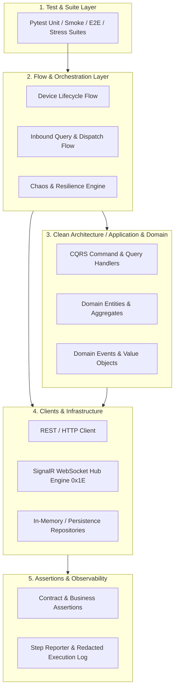

# 📦 Core Post Sorting & Integration Automation Platform


A sanitized, production-grade **QA / SDET & Backend Engineering Portfolio Project** demonstrating Clean Architecture, Domain-Driven Design (DDD), resilient protocol engines (REST & SignalR/WebSocket), core parcel sorting integration flows, chaos engineering, and step-level test observability.

This repository is a portfolio representation designed to demonstrate advanced software quality engineering practices. End-to-end and stress tests run against configurable mock or demo services.

---

## 🌟 Key Highlights & Capabilities

- **Clean Architecture & DDD (CQRS):** Full separation of concerns across `application/` (Commands/Queries/Ports), `domain/` (Entities/Value Objects/Events), `infrastructure/` (In-Memory & SQL Persistence), and `interfaces/` (REST Controllers & DTOs).
- **Dual Network Protocols:**
  - **REST API (HTTP/JSON):** Session pooling, bearer token management, idempotency header tracking, and automatic retry.
  - **SignalR Hub Protocol over WebSocket:** Complete RFC compliance with ASCII `0x1E` record delimiters, handshake negotiation, invocation tracking via `UUID`, keep-alive/ping handling, and completion matching.
- **Core Post Sorting Domain (CPS Modules):**
  - `CPS-9`: Protocol contract verification and backward compatibility.
  - `CPS-20`: Inbound parcel query, physical discrepancy detection, and return handling.
  - `CPS-33`: Idempotent mutation handling and duplicate request safety.
  - `CPS-49`: Sorting device deactivation, lifecycle auditing, and state tracking.
  - `CPS-58` & `CPS-80`: Object Storage integration, S3 Pre-signed URLs, and camera image metadata staging.
  - `CPS-61`: Document & attachment digital link management.
  - `CPS-63`: Postal barcode checksum and format validation engine.
  - `CPS-65`: Multi-factor parcel status evaluation matrix.
  - `CPS-67`: Bag & dispatch container lifecycle management.
  - `CPS-70`: Role-Based Access Control (RBAC) and exchange center scoping.
  - `CPS-74`: Sorting device registration, logical code uniqueness, and IP abstraction.
  - `CPS-77`: Bootstrap configuration versioning and immutable snapshot publisher.
  - `CPS-82`: Edge node health monitoring, heartbeat telemetry, and threshold alerting.
  - `CPS-86`: Operational result storage and edge-to-cloud resilience.
  - `CPS-164`: Automated stage deployment and patch verification.
- **Chaos & Resilience Testing (EPS-151):**
  - High-concurrency fault injection (500+ influx).
  - Recovery Time Objective (RTO) calculation using `time.perf_counter()`.
  - SQLite transaction verification ensuring **Zero Data Loss**.
- **Dynamic Mock Environment Generator (EPS-181):**
  - Automated generation of ASP.NET Core environment variable overrides to simulate timeouts, service rejections, and upstream failures.
- **Built-in Step Reporter & Observability:**
  - Granular step timing, payload capturing, and automatic **secret redaction** (`password`, `token`, `authorization`, `secret`).
- **Educational Knowledge Base (`tutorial/`):**
  - 13 comprehensive, bilingual (Persian/English) tutorial modules covering Python mastery (OOP, Dunder methods, Type hints, Comprehensions) and test architecture.

---

## 🏛️ System Architecture



---

## 📁 Repository Structure

```text
application/    CQRS Commands, Queries, Handlers, and Port interfaces
domain/         Domain Entities, Value Objects, Domain Events, and Evaluators
infrastructure/ In-memory / SQL Repositories, Event Publishers, and Configs
interfaces/     REST Controllers, DTOs, and Service Apps
clients/        REST (HttpClient) and SignalR WebSocket protocol clients
services/       Reusable domain service abstractions (Admin, Device, Backend)
flows/          Scenario orchestration (Auth, Bag, Chaos, Inbound, Stage, Validation)
assertions/     Contract and domain-specific response assertions
config/         Settings dataclass, scenario catalog, and environment mappings
docs/           Domain specifications, scenario matrix, and coverage documentation
tests/          Pytest test suites (unit, 1_device_lifecycle, 2_inbound, 3_destination, 4_bagging, 5_monitoring, stress)
tutorial/       13-chapter in-depth Python and Test Architecture training guide
utils/          Step reporter, secret redaction, test data generator, mock generator
scripts/        Test runners (run_all_tests.py, run_core_tests.py, run_scenarios.py)
```

---

## 🧪 Test Categories & Execution

| Category | Description | Command |
|---|---|---|
| **Unit Tests** | Fast, isolated tests for Domain, Application, Clients, Assertions, and Utilities | `.venv\Scripts\python.exe -m pytest tests/unit -q` |
| **Default Safe Suite** | Standard safe suite run in CI/CD pipelines | `.venv\Scripts\python.exe -m pytest -q` |
| **Core CPS Tests** | Comprehensive unit runner for all CPS sorting scenarios | `.venv\Scripts\python.exe scripts/run_core_tests.py` |
| **Success / E2E** | Happy path end-to-end integration flows (requires mock/demo backend) | `$env:RUN_E2E="1"; pytest tests/success -q -s` |
| **Negative Scenarios** | Business error handling, schema rejections, and unauthorized flows | `$env:RUN_E2E="1"; pytest tests/negative -q -s` |
| **Chaos & Stress** | High-load concurrency, network partition, and crash recovery | `$env:RUN_EPS151="1"; pytest tests/stress -q -s -o addopts=""` |

---

## ⚙️ Configuration & Environment

1. Install dependencies:
   ```powershell
   .venv\Scripts\python.exe -m pip install -r requirements.txt
   ```
2. Setup environment configuration:
   ```powershell
   Copy-Item config/test.env.example config/test.env
   ```
3. Edit `config/test.env` with your mock service endpoints. Default placeholders (`api.example.invalid`, `demo-device`, `demo-token`) prevent accidental connection to production.

---

## 📊 Sample Step Execution Report

When executing flows, the built-in `ExecutionReport` captures detailed telemetry with sensitive data masked:

```text
Execution report: CPS-20 Core Inbound Query Flow
01. [PASS] TC-01: Inbound Query Success - New parcel with valid physical data
    payloadSent: {"method": "POST", "url": "http://localhost:5080/api/edge/parcels/inbound-query", "payload": {"parcelBarcode": "590001234567890123456789", ...}}
    responseReceived: {"statusCode": 200, "body": {"status": "success", "recordedOriginCode": "59544", "recordedDestinationCode": "11369", "discrepancyDetected": false}}
    expected: PASS
02. [PASS] TC-02: Inbound Query - Returning parcel detected (Status: returning)
    payloadSent: {"method": "POST", "url": "http://localhost:5080/api/edge/parcels/inbound-query", ...}
    responseReceived: {"statusCode": 200, "body": {"status": "returning", "discrepancyDetected": true}}
    expected: PASS

Result: PASS=2, FAIL=0, NOT_CHECKED=0
```

---

## 🔒 Security & Public Sanitization

This repository is sanitized for public review:
- All internal network IP addresses (e.g. `192.168.*`) have been replaced with standard localhost or mock endpoints (`api.example.invalid`).
- All credentials, tokens, and secrets are replaced with safe placeholders (`demo-admin`, `demo-token`).
- Proprietary hostnames and identifiers are neutralized.
- GitHub Actions CI enforces secret-pattern scanning on every push.

See [`SECURITY.md`](SECURITY.md) and [`CONTRIBUTING.md`](CONTRIBUTING.md) for contribution guidelines.

---

## 📚 Learning & Tutorial Guide

Explore the [`tutorial/`](tutorial/) directory for a complete step-by-step masterclass:
- **Chapters 1–6 (`08`–`13`):** Core Python Mastery (Control Flow, OOP, Type Hints, Idioms, Dunder Methods, Standard Library).
- **Chapters 7–13 (`01`–`07`):** SDET Architecture (Layering, Protocols, Contract Testing, Observability, Stress & CI/CD).
