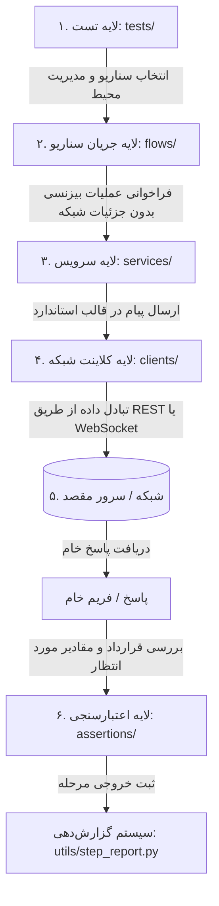

# 🏛️ معماری و الگوهای طراحی (Architecture & Design Patterns)

در این بخش بررسی می‌کنیم که این پروژه چگونه معماری شده و از چه الگوهای طراحی نرم‌افزار (Design Patterns) برای تمیز، خوانا، ماژولار و مقیاس‌پذیر نگه داشتن تست‌ها استفاده کرده است.

---

## ۱. دیاگرام جریان معماری لایه‌ای (Layered Architecture)

یکی از بزرگ‌ترین اشتباهات در پروژه‌های تست اتوماسیون این است که تست مستقیماً درخواست HTTP بزند، پاسخ را خودش پارس کند و چند مرحله بیزنسی را یکجا اجرا کند. در این پروژه معماری به صورت **۶ لایه مجزا** طراحی شده است:



---

## ۲. بررسی تک‌تک لایه‌ها

### لایه ۱: تست‌ها (`tests/`)
- **وظیفه:** صرفاً سناریو را صدا می‌زند و نتیجه نهایی را بررسی می‌کند.
- **ویژگی:** هیچ منطق شبکه‌ای یا URL در تست نوشته نمی‌شود. تست‌ها بسیار کوتاه، خوانا و واضح هستند (معمولاً زیر ۱۰ تا ۱۵ خط).
- **مثال:** `tests/success/test_base_success.py`

### لایه ۲: جریان‌ها (`flows/`)
- **وظیفه:** هماهنگ‌کننده (Orchestrator) چند گام متوالی بیزنسی.
- **مثال:**
  1. اول لاگین ادمین
  2. سپس ثبت IP دستگاه
  3. سپس اتصال سوکت
  4. سپس احراز هویت دستگاه
  5. سپس ثبت بارکد و دریافت پاسخ
- **ویژگی:** هر مرحله را به عنوان یک Step در سیستم گزارش‌دهی ثبت می‌کند.

### لایه ۳: سرویس‌ها (`services/`)
- **وظیفه:** انتزاع (Abstraction) مفاهیم بیزنس دستگاه.
- **مثال:** `DeviceService` متدهایی مثل `auth()`, `register_inbound()`, `assign_destination()`, `close_bag()` دارد.
- **ویژگی:** جزئیات پروتکل (اینکه فرمت Json چه ساختاری دارد یا پیام به کدام متد SignalR می‌رود) در سرویس کپسوله می‌شود.

### لایه ۴: کلاینت‌ها (`clients/`)
- **وظیفه:** ارتباط فیزیکی و پروتکلی خالص با شبکه.
- **کلاینت‌ها:**
  - `RestClient`: مدیریت نشست‌های HTTP و هدرها.
  - `DeviceWebSocketClient`: مدیریت اتصال سوکت، هندشیک SignalR، پینگ/پونگ و هندلینگ بایت‌های انتهایی `0x1E`.

### لایه ۵: اعتبارسنجی‌ها (`assertions/`)
- **وظیفه:** بررسی قوانین و قراردادهای پاسخ‌ها (Contract Assertions).
- **مثال:** `assert_success_response(response, "Auth")` یا `assert_valid_bag_close_response(response)`.
- **مزیت:** به جای استفاده از `assert response["status"] == 200` پراکنده، تست‌ها از توابع یکپارچه و خوانا با پیام‌های خطای شفاف استفاده می‌کنند.

### لایه ۶: گزارش‌دهی و ابزارها (`utils/`)
- **وظیفه:** ثبت لاگ ساختاریافته، ردگیری زمان اجرای هر گام، ماسک کردن اطلاعات امنیتی (مانند توکن و پسورد) و تولید دیتای تست تصادفی.

---

## ۳. الگوهای طراحی (Design Patterns) استفاده شده

### ۱. الگوی Facade (نما)
- **کجا استفاده شده؟** در لایه `flows` و `services`.
- **چرا؟** برای اینکه تست‌ها نیاز نباشد با پیچیدگی‌های داخلی مثل باز کردن سوکت، ایجاد InvocationId، ساخت انولوپ (Envelope) پروتکل و اعتبارسنجی هندشیک درگیر شوند. سرویس یک رابط کاربری تمیز و ساده (Facade) ارائه می‌دهد.

### ۲. الگوی Adapter / Wrapper (تطبیق‌دهنده)
- **کجا استفاده شده؟** در `clients/rest_client.py` و `clients/signalr_client.py`.
- **چرا؟** کتابخانه‌های خام مثل `requests` یا `websocket-client` برای سناریوهای تست به تنهایی کافی نیستند؛ ما نیاز داریم هر درخواست و پاسخ فرستاده شده را در حافظه نگه داریم (`last_exchange`) تا در صورت بروز خطا، دقیقاً به کاربر نشان دهیم چه پیامی ارسال و چه پاسخی دریافت شده است.

### ۳. الگوی Context Manager (`__enter__` و `__exit__`)
- **کجا استفاده شده؟** در `RestClient` و `DeviceWebSocketClient`.
- **چرا؟** برای اینکه اتصالات و سوکت‌ها به طور خودکار باز و در پایان تست (حتی در صورت بروز خطا یا Exception) فوراً و به صورت تمیز بسته شوند (`resource cleanup`):
```python
with DeviceWebSocketClient(ws_url) as ws:
    # کارهای سوکت
# در اینجا اتصال به طور خودکار بسته می‌شود
```

### ۴. الگوی Step Runner / Pipeline
- **کجا استفاده شده؟** در تابع `run_step` در `utils/step_report.py`.
- **چرا؟** برای اینکه اجرای هر گام به عنوان یک اکشن مستقل کپسوله شود، زمان اجرای آن محاسبه گردد، در صورت موفقیت وضعیت `PASSED` و در صورت خطا وضعیت `FAILED` ثبت شده و بلافاصله ادامه گام‌ها لغو و با وضعیت `NOT_EXECUTED` مشخص شوند.

### ۵. الگوی Immutability & Safe Defaults با Dataclasses
- **کجا استفاده شده؟** در کلاس `Settings` در `config/settings.py` با دکوراتور `@dataclass(frozen=True)`.
- **چرا؟** تنظیمات برنامه نباید در حین اجرای تست‌ها به صورت تصادفی توسط هیچ کدی تغییر داده شوند. همچنین تمام تنظیمات دارای مقادیر پیش‌فرض معتبر و امن (Safe Defaults) هستند.
