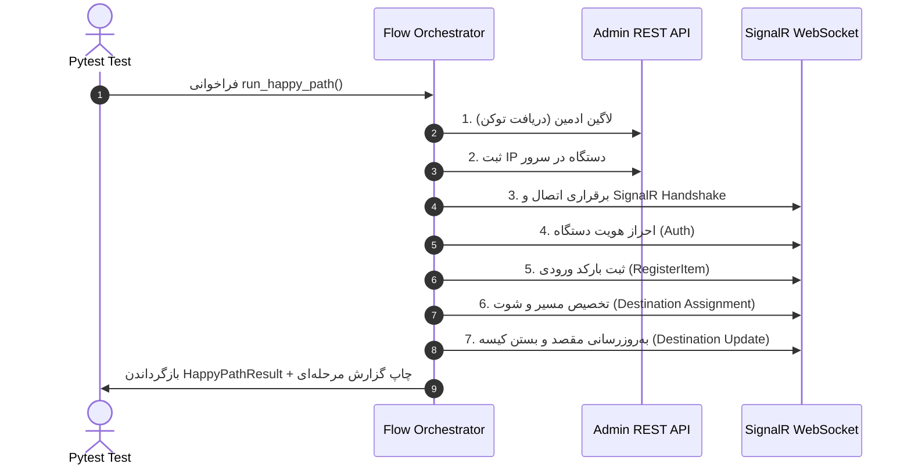

# 🔄 مدیریت جریان‌ها و سناریوهای آزمون (Flows & Orchestration)

لایه **Flows** قلب تپنده هماهنگی تست‌های ادغامی (Integration) و سرتاسری (End-to-End) است. در این بخش می‌آموزیم که چگونه سناریوهای پیچیده با ترتیب گام‌های مختلف سازمان‌دهی شده‌اند.

---

## ۱. تفاوت Service و Flow چیست؟

| ویژگی | Service (`services/`) | Flow (`flows/`) |
|---|---|---|
| **دامنه کار** | انجام **یک عملیات منفرد** (Single Operation) | هماهنگی **چندین عملیات متوالی** (Sequence of Operations) |
| **وابستگی** | فقط به Client متصل است | ممکن است چند Client و چند Service را ترکیب کند |
| **سیستم گزارش‌دهی** | از `step_report` خبر ندارد | هر مرحله را در `ExecutionReport` ثبت و مدیریت می‌کند |
| **مثال** | متد `device.register_inbound(barcode)` | تابع `run_happy_path()` که لاگین، سوکت، رجیستر و تخصیص مقصد را پشت هم اجرا می‌کند |

---

## ۲. بررسی یک سناریوی کامل مثبت (Happy Path Flow)

در فایل `flows/device_lifecycle/device_auth_flow.py` تابع `run_happy_path` جریان استاندارد کل سیستم را پیاده‌سازی می‌کند:



### ویژگی‌های کلیدی در طراحی Flow:
1. **ثبت پیشاپیش مراحل (Step Registration):**
   در ابتدای اجرای هر Flow، تمام گام‌هایی که قرار است اجرا شوند در ریپورت ثبت می‌شوند:
   ```python
   report = ExecutionReport("Project base success flow")
   report.register(
       "1. [BASE] Admin Login - POST /api/admin/login",
       "2. [BASE] Update Device IP - PUT /api/devices/{deviceId}/ip",
       "3. [BASE] SignalR Connect/Handshake - WebSocket /hubs/device",
       ...
   )
   ```
2. **استفاده از `run_step` برای کنترل و ایزولاسیون:**
   هر مرحله داخل `run_step` فراخوانی می‌شود تا اگر در گام ۲ خطایی رخ داد، گزارش متوقف شده، مراحل بعدی `NOT_EXECUTED` علامت بخورند و خطای اصلی با جزئیات کامل ذخیره شود.
3. **بازگرداندن شیء ساختاریافته خروجی (`HappyPathResult`):**
   یک dataclass خروجی شامل پاسخ‌های مهم، توکن ادمین و آبجکت گزارش برگردانده می‌شود تا تستی که این Flow را صدا زده بتواند assertionهای تکمیلی روی داده‌ها انجام دهد.

---

## ۳. سناریوهای منفی (Negative Scenarios)

تست‌های منفی رفتار سیستم را در شرایط ورودی نامعتبر، قطع ارتباط، خطاهای بیزنسی و احراز هویت ناقص بررسی می‌کنند.

در پوشه `flows/` برای بخش‌های مختلف سناریوهای منفی طراحی شده است:
- **`flows/device_lifecycle/device_lifecycle_negative_flow.py`:** تلاش برای ارسال پیام قبل از لاگین یا با توکن نامعتبر.
- **`flows/destination/destination_assignment_negative_flow.py`:** ارسال بارکد ثبت‌نشده یا کد مقصد نامعتبر.
- **`flows/destination/destination_update_negative_flow.py`:** تلاش برای تغییر مقصد پس از بستن کیسه (`TC-05: Reject update after container close`).
- **`flows/bag/export_before_container_negative_flow.py`:** تلاش برای خروج یا ارسال قبل از بسته‌شدن کانتینر فیزیکی.

### الگوی تست سناریوی منفی:
در سناریوهای منفی، انتظار ما خطا دادن سیستم است؛ بنابراین بررسی می‌کنیم که:
1. آیا سرور خطای مناسب برگردانده؟ (`errorCode` یا پیام قابل فهم)
2. آیا سیستم کرش نکرده و وضعیت دیتابیس سالم مانده؟
3. آیا کانکشن سوکت قطع نشده یا به طور ایمن پاسخ خطا داده است؟
